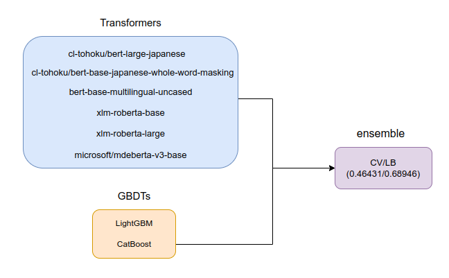

# ProbSpace 民泊サービスの宿泊料金予測 1st place solution
https://comp.probspace.com/competitions/bnb_price

## Team Member
- [ktr](https://comp.probspace.com/users/ktr/0)
- [laba](https://comp.probspace.com/users/laba/0)
- [junei.t.520.5](https://comp.probspace.com/users/junei.t.520.5/0)

## WIP
* [X] adding junei code

## CV
KFold(n_split=5)

## Model
- Transformers：number_of_reviews、minimum_nights、room_type、neighbourhood、nameを結合してinput
- GBDTs：ラベルエンコーディング、nameのTF-IDFなどの一般的な特徴量

## Ensemble
8 models weighted average (Nelder-Mead)